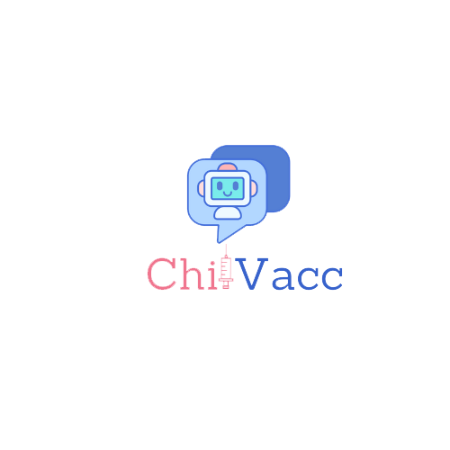

# ChilVacc

## Gestion del Proyecto en Jira

[Jira ChilVac](https://chill-vacc.atlassian.net/jira/software/projects/CHIL/boards/1/roadmap)

## ChatBot

Se realiza un chatbot empleado librerías como nltk, tensorflow, entre otras para tener un chatbot por medio de un árbol de decisiones y una pequeña red neuronal para irlo entrenando.

### Backend

[ChilVacc-API](https://github.com/eldelahoz/ChilVacc/tree/Entrega2/ChilVacc-API)

### Frontend

[ChilVacc](https://github.com/eldelahoz/ChilVacc/tree/Entrega2/ChilVacc)
