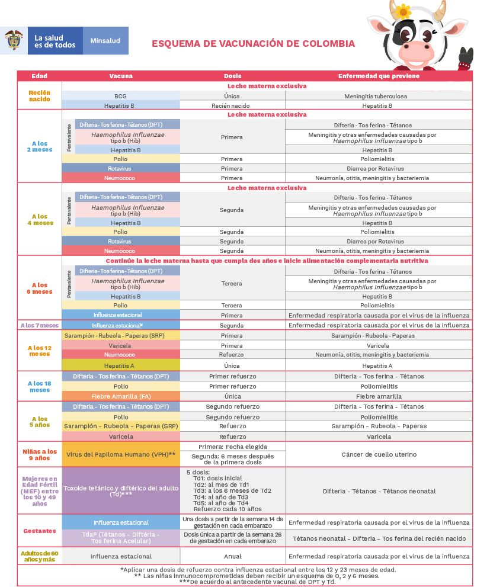

# ChilVacc

## Propuesta de trabajo:

> Desarrollar una aplicación web con un chatbot para ayudar a los papás estar atentos con el esquema de vacunación de sus hijos y dar respuesta a esquema tardío de vacunación.

## Algunas preguntas comunes:

### ¿Por qué debo vacunar a mi hijo?

Porque las vacunas protegen a los niños de enfermedades peligrosas. Estas enfermedades pueden tener complicaciones graves o secuelas y provocar incluso la muerte.
Algunos de estos padecimientos son ahora muy poco frecuentes, pero esto es debido precisamente al mantenimiento de las vacunaciones en toda la población.

### ¿Qué enfermedades evitan las vacunas?

Las vacunas más comúnmente empleadas en nuestro país son las siguientes: hepatitis B, difteria, tétanos, tosferina, polio, Haemophilus influenzae tipo b, meningococos C y ACWY, neumococo, sarampión, rubeola, parotiditis o paperas, varicela, virus del papiloma humano, rotavirus, meningococo B, hepatitis A y gripe.

### ¿Tienen las vacunas efectos secundarios?

Sí, algunas vacunas pueden tener efectos secundarios, los cuales pueden ser: fiebre leve, salpullido o dolor en el lugar de la aplicación.

### ¿Por qué debo guardar y cuidar el carné de vacunación?

Este es un documento que contiene los registros de dosis de vacuna aplicadas desde el nacimiento, hace parte de la historia de salud de la persona y se requiere para consultas médicas, de enfermería, cirugías, viajes nacionales e internacionales y matricularse en las entidades educativas. En el país hay carné de vacunación de niños, carné de vacunación de adultos y certificado internacional de vacunación.

### ¿Contra qué enfermedades me protegen las vacunas?

En el esquema colombiano hay 21 vacunas las cuales protegen contra 26 enfermedades.

### ¿Por qué no se puedo esperar hasta que los niños empiecen el colegio para ponerle las vacunas?

Las vacunas deben empezar al momento del nacimiento y terminar en su mayor parte a la edad de dos años. Al vacunar a los niños a tiempo (antes de los dos años) usted los puede proteger de infecciones e impedir que contagien a otros niños en la escuela o guardería. Los niños menores de seis años son muy susceptibles de contraer enfermedades porque su sistema inmunológico no ha desarrollado las defensas necesarias para luchar contra las infecciones.
